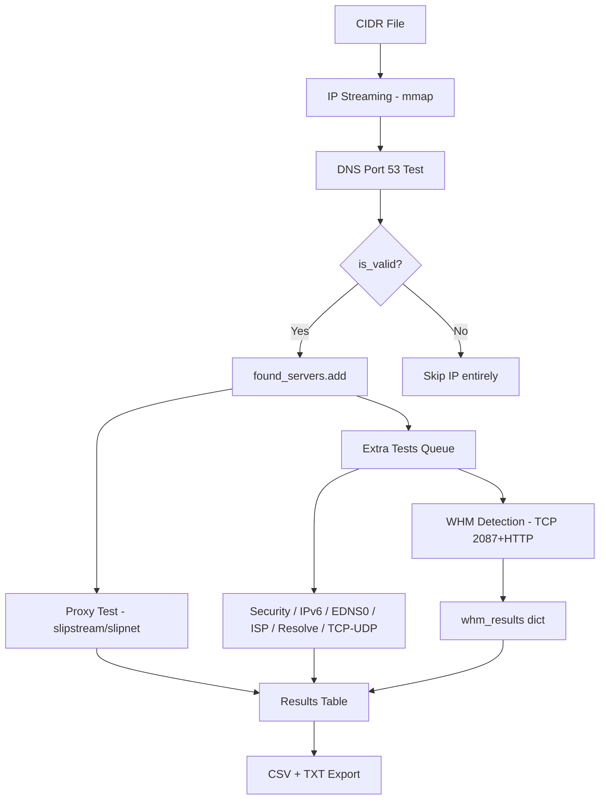
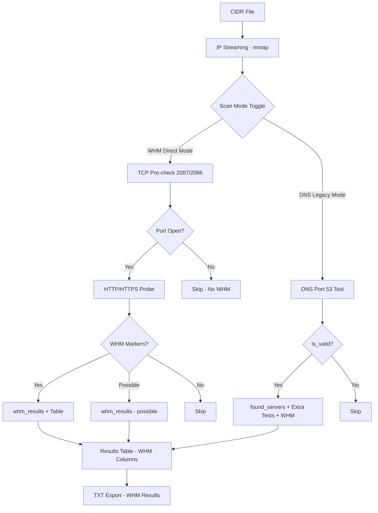

# PYDNS Transformation Plan: DNS-First → WHM-First Scanner

## Current Architecture (DNS-Gated)



**Critical bottleneck**: WHM detection only runs on IPs that pass DNS port 53 test. A server with WHM but no DNS is invisible.

---

## Target Architecture (WHM-First, Dual-Mode)



---

## Implementation Plan

### Phase 1: Core WHM-Direct Scan Pipeline (New File)

**File**: `python/scanner/whm_worker.py` (NEW)

Create a dedicated WHM scanning engine that operates independently of DNS:

| Step | Description |
|------|-------------|
| 1.1 | Create `WhmScanner` class with `scan_batch(ips: list[str]) -> dict` |
| 1.2 | Implement TCP pre-check using `asyncio.open_connection()` with 3s timeout |
| 1.3 | Implement HTTP probe using shared `httpx.AsyncClient` (reuse pattern from `_test_whm`) |
| 1.4 | Support configurable concurrency via `asyncio.Semaphore` |
| 1.5 | Return structured results: `{ip: {whm, hostname, port, path, possible, open_ports}}` |
| 1.6 | Add progress callback for real-time TUI updates |
| 1.7 | Support pause/resume via `asyncio.Event` (same pattern as DNS scan) |

**Key design decisions**:
- WHM scanning is HTTP-based, so concurrency should be lower than DNS UDP (50-200 vs 100-600)
- TCP pre-check avoids wasting HTTP resources on closed ports
- Shared `httpx.AsyncClient` with `verify=False`, `limits=max_connections=50`
- Timeout: 8s per HTTP probe (already proven in `_test_whm`)

---

### Phase 2: TUI Form Restructuring

**File**: `python/dnsscanner_tui.py`

| Step | Description | Lines Affected |
|------|-------------|----------------|
| 2.1 | Add `scan_mode` state variable: `"whm"` or `"dns"` (default: `"whm"`) | `__init__` ~line 540 |
| 2.2 | Add Scan Mode radio/select at top of form in `compose()` | `compose` ~line 658 |
| 2.3 | Add `_toggle_scan_mode()` method to show/hide fields based on mode | new method |
| 2.4 | When WHM mode: hide domain, random subdomain, slipstream, slipnet, proxy fields | `_toggle_scan_mode` |
| 2.5 | When WHM mode: show WHM-specific fields (HTTP timeout, TCP timeout, concurrency) | `_toggle_scan_mode` |
| 2.6 | When DNS mode: show all existing fields (current behavior) | `_toggle_scan_mode` |
| 2.7 | Update `_apply_scan_preset()` — WHM preset sets `scan_mode = "whm"` | ~line 1690 |
| 2.8 | Update `_start_scan_from_form()` to read `scan_mode` and branch | ~line 1702 |
| 2.9 | Update config persistence to save/load `scan_mode` | `_load_config` / `_save_config` |

**WHM Mode Form Layout** (simplified):
```
┌─────────────────────────────────────────┐
│ Scan Mode:  ○ WHM Scanner  ○ DNS Scanner│
├─────────────────────────────────────────┤
│ CIDR File:  [indonesia-dc-ipv4 ▼]       │
│ Concurrency: [100]                       │
│ HTTP Timeout: [8.0] sec                  │
│ TCP Timeout:  [3.0] sec                  │
│ ☑ WHM Detection (always on)             │
│ ☐ Bell Sound                             │
│ ☐ Debug Mode                             │
│                                          │
│ [▶ Start Scan]                           │
└─────────────────────────────────────────┘
```

---

### Phase 3: WHM-Direct Scan Loop

**File**: `python/dnsscanner_tui.py`

| Step | Description |
|------|-------------|
| 3.1 | Create `_scan_whm_direct()` method — the WHM-only scan loop |
| 3.2 | Reuse IP streaming: `_stream_ips_redis_style()` or `_stream_ips_from_file()` |
| 3.3 | For each IP batch, create `WhmScanner.scan_batch()` tasks |
| 3.4 | Process results: update `whm_results`, add to table, update stats |
| 3.5 | Support pause/resume/shuffle (same `pause_event` / `shuffle_signal` pattern) |
| 3.6 | Auto-save TXT on completion via `_save_whm_results_txt()` |
| 3.7 | Add `_scan_async()` branching: `if self.scan_mode == "whm": await self._scan_whm_direct()` |

**WHM-Direct Scan Loop Pseudocode**:
```python
async def _scan_whm_direct(self):
    # Reset state
    self.whm_results.clear()
    self.current_scanned = 0
    
    # Shared HTTP client (higher connection pool for direct mode)
    self._http_client = httpx.AsyncClient(
        verify=False, timeout=8.0,
        limits=httpx.Limits(max_connections=100, max_keepalive_connections=30),
    )
    
    # Semaphore for concurrency control
    sem = asyncio.Semaphore(self.concurrency)
    
    # Stream IPs
    async for ip_batch in self._stream_ips_redis_style():
        tasks = []
        for ip in ip_batch:
            task = asyncio.create_task(self._whm_probe(ip, sem))
            tasks.append(task)
        
        # Wait for batch completion
        results = await asyncio.gather(*tasks, return_exceptions=True)
        
        # Process results
        for ip, result in zip(ip_batch, results):
            self.current_scanned += 1
            if isinstance(result, dict) and result.get("whm"):
                self.whm_results[ip] = result
                self._add_whm_result(ip, result)
    
    # Auto-save
    self._save_whm_results_txt(...)
```

---

### Phase 4: Results Table Adaptation

**File**: `python/scanner/results.py` + `python/dnsscanner_tui.py`

| Step | Description |
|------|-------------|
| 4.1 | Add `_add_whm_result()` method for WHM-direct mode (no DNS columns needed) |
| 4.2 | Create WHM-mode table columns: IP, WHM, Hostname, Port, ISP |
| 4.3 | Add `_get_table_columns_whm()` returning WHM-specific column definitions |
| 4.4 | Update `_get_table_columns()` to branch on `scan_mode` |
| 4.5 | Update `_rebuild_table()` sort key for WHM mode (WHM-positive first, then IP) |
| 4.6 | Update `on_data_table_row_selected()` for WHM-mode detail display |
| 4.7 | Update `_tick_stats()` to show WHM-specific stats (found/total/scanned) |

**WHM Mode Table Columns**:
| Column | Width | Content |
|--------|-------|---------|
| IP | 15 | Server IP address |
| WHM | 4 | ✓ (found) / ⚠ (possible) / ✗ (no) |
| Hostname | 25 | Server hostname from WHM |
| Port | 6 | 2087 / 2086 |
| ISP | 20 | ISP name from cache |

---

### Phase 5: Standalone WHM Scanner Script

**File**: `python/whm_scan.py` (NEW)

| Step | Description |
|------|-------------|
| 5.1 | Create CLI script for headless WHM scanning (no TUI) |
| 5.2 | Accept arguments: `--cidr`, `--concurrency`, `--timeout`, `--output` |
| 5.3 | Use same `WhmScanner` engine from Phase 1 |
| 5.4 | Output progress to stdout, results to TXT file |
| 5.5 | Support Ctrl+C graceful shutdown with partial results save |

Usage: `python -m python.whm_scan --cidr indonesia-dc-ipv4.cidrs --concurrency 100`

---

### Phase 6: Polish & Integration

| Step | Description |
|------|-------------|
| 6.1 | Update `_preset_display_name()` for new WHM-direct preset |
| 6.2 | Update `_auto_save_results()` to handle WHM-only mode (skip CSV, only TXT) |
| 6.3 | Update `action_save_results()` for manual save in WHM mode |
| 6.4 | Update `action_quit()` cleanup for WHM mode resources |
| 6.5 | Update `README.md` with WHM Scanner documentation |
| 6.6 | Update `RELEASE_NOTES.md` for v2.1.0 |
| 6.7 | Run full syntax validation on all modified files |
| 6.8 | Test with known WHM targets from `whm-test-targets.cidrs` |

---

## File Change Summary

| File | Action | Impact |
|------|--------|--------|
| `python/scanner/whm_worker.py` | **NEW** | Core WHM scanning engine |
| `python/whm_scan.py` | **NEW** | Headless CLI WHM scanner |
| `python/dnsscanner_tui.py` | **MODIFY** | Scan mode toggle, WHM scan loop, form restructuring |
| `python/scanner/results.py` | **MODIFY** | WHM-mode table columns, sort, display |
| `python/scanner/extra_tests.py` | **NO CHANGE** | Already solid, used by DNS legacy mode |
| `python/scanner/ip_streaming.py` | **NO CHANGE** | Reused as-is for both modes |
| `python/whm_test.py` | **NO CHANGE** | Already solid standalone tester |
| `README.md` | **MODIFY** | Documentation update |
| `RELEASE_NOTES.md` | **MODIFY** | v2.1.0 release notes |

---

## Concurrency Model Comparison

| Aspect | DNS Mode (current) | WHM Direct Mode (new) |
|--------|-------------------|----------------------|
| Protocol | UDP port 53 | TCP 2087/2086 + HTTP |
| Test duration | ~1-3 seconds | ~3-8 seconds |
| Optimal concurrency | 200-600 | 50-200 |
| Worker pool | Background thread + ProactorEventLoop | Main event loop (httpx async-native) |
| Connection reuse | N/A (UDP) | httpx connection pool (keep-alive) |
| Bottleneck | UDP socket buffer | TCP handshake + TLS + HTTP response |
| Memory per worker | ~2KB (UDP packet) | ~16KB (HTTP response body) |

---

## Risk Mitigation

| Risk | Mitigation |
|------|------------|
| HTTP concurrency overwhelming target servers | Semaphore cap + configurable concurrency |
| TLS handshake overhead for HTTPS (2087) | TCP pre-check filters closed ports first |
| Memory pressure from HTTP response bodies | 16KB body limit, immediate GC after processing |
| Breaking existing DNS functionality | Dual-mode design — DNS mode unchanged |
| Slow scanning speed vs DNS mode | Lower concurrency but no DNS gate = more WHM hits per IP scanned |